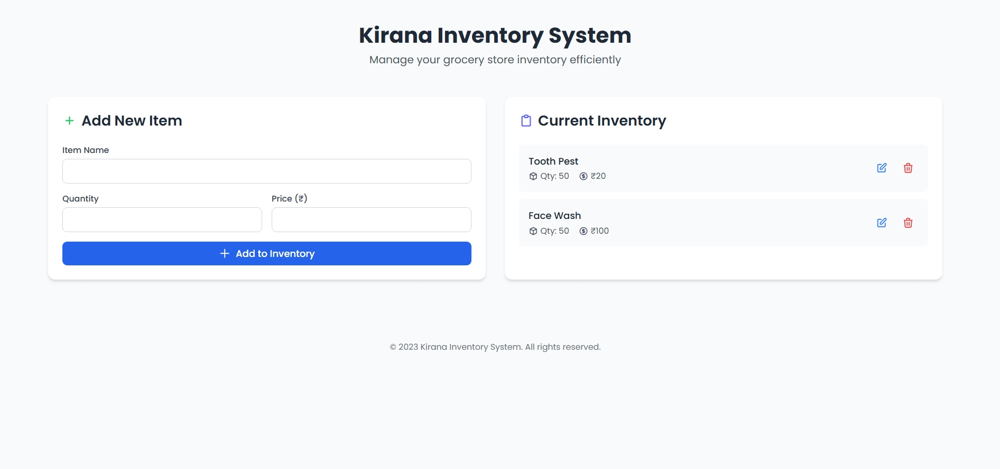

# 🛒 Kirana Inventory System

The **Kirana Inventory System** is a simple, beginner-friendly web application to manage inventory for a small grocery store (kirana store). This project is built using **Flask**, **HTML (Jinja2 templating)**, **Tailwind CSS**, and **Docker**.


---

## 🚀 Features

- Add new grocery items with quantity and price.
- See current inventory in real-time.
- Responsive UI using **Tailwind CSS**.
- Dockerized for easy deployment.

---

## 🧰 Tech Stack

- **Backend:** Python (Flask)
- **Frontend:** HTML, Jinja2, Tailwind CSS
- **Containerization:** Docker

---

## 🐳 Run with Docker

```bash
# Build the Docker image
docker build -t kirana-app .

# Run the Docker container
docker run -p 5000:5000 kirana-app

cd app
pip install -r requirements.txt
python app.py


